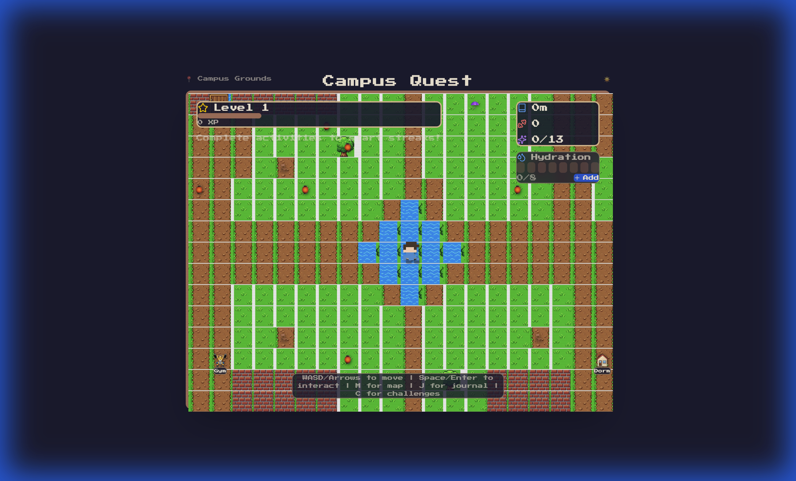

# Campus Quest

A pixel-art style exploration game built with React and Vite.



## Features
- **Exploration**: Navigate a procedurally generated campus map.
- **Day/Night Cycle**: Dynamic lighting effects based on in-game time.
- **Stats System**: Manage hydration and XP.
- **Interactive Objects**: Interact with buildings and items.

## Getting Started

1. Install dependencies:
   ```bash
   npm install
   ```

2. Run development server:
   ```bash
   npm run dev
   ```

## Tech Stack
- React
- Redux Toolkit
- Tailwind CSS
- Vite
